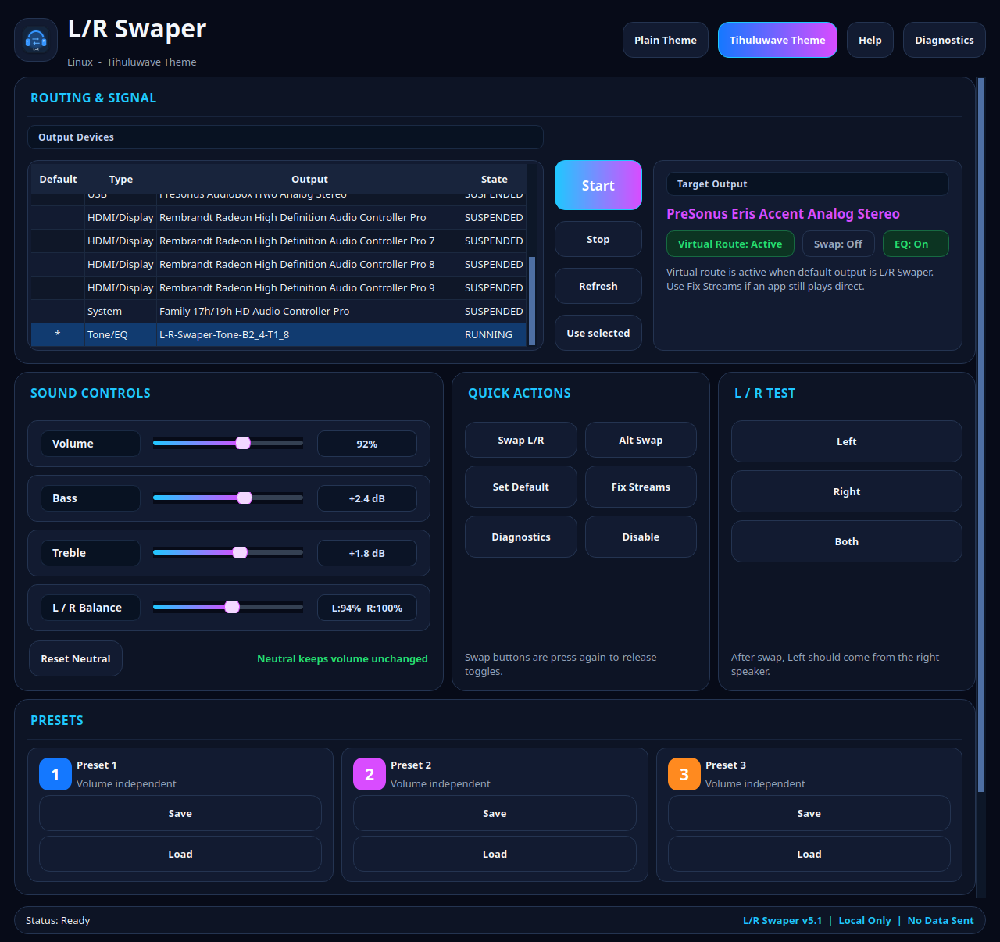

# L/R Swaper and EQ

Cross-platform left/right channel swapper and simple EQ project.

Repository: <https://github.com/Tihulu/L-R-Swaper-and-EQ>

## Platforms

| Platform | Folder | Status |
| --- | --- | --- |
| Pop!_OS / Ubuntu Linux | [`linux/`](linux/) | v5.1 stable Linux build |
| macOS Apple Silicon | [`macos/`](macos/) | macOS app and BlackHole-based routing notes |

## Linux UI Preview

## Linux quick install

    bash <(curl -fsSL https://raw.githubusercontent.com/Tihulu/L-R-Swaper-and-EQ/main/linux/quick-install.sh)

Then open **L/R Swaper** from the app menu or run:

    lr-swaper

## Linux v5.1

- Latest stable Linux build: **v5.1 balance-box fixed**.
- L/R Balance value box is fixed so the text fits.
- Balance display uses compact text such as `L:94%  R:100%`.
- Tihuluwave Qt UI and Plain Theme are included.
- Quick install and manual install instructions are documented in English under [`linux/README.md`](linux/README.md).
- Older Linux release notes can remain archived under [`RELEASES/`](RELEASES/).

More details: [`linux/README.md`](linux/README.md)

GPL-3.0-or-later — see [`LICENSE.txt`](LICENSE.txt)
